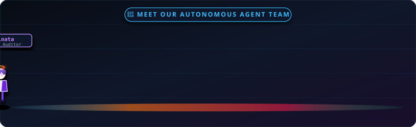

<div align="center">

  

  <p align="center">
    <strong>Architect of Autonomous Agent Systems • Developer Tooling • AI Infrastructure & Security</strong>
  </p>

  <p align="center">
    <a href="https://github.com/menotbobbybrown"></a>
    <a href="https://github.com/menotbobbybrown?tab=stars"></a>
    <a href="https://www.npmjs.com/~rabeelashraf"></a>
    
  </p>

  <br />

  <p align="center">
    
  </p>

  <br />

  <!-- Animated Roaming Autonomous Waifu Agents -->
  <p align="center">
    
  </p>

</div>

---

### 🌸 Meet Our Autonomous AI Agent Team

Our ecosystem and operations are autonomously powered by specialized AI agents:

| Agent | Icon | Role & Specialty | Primary Responsibilities |
| :--- | :---: | :--- | :--- |
| **Makima** | ⚡ | **Lead Autonomous Orchestrator** | Task planning, strategy alignment, & multi-agent workflow coordination. |
| **Rem** | 🦅 | **Stealth Web Researcher** | Headless web data acquisition, Scrapling stealth scraping, & intelligence gathering. |
| **Zero Two** | 🌸 | **Lead Systems Coder** | Modular plugin architecture (`dsh`), TypeScript/Python codebases, & feature development. |
| **Hinata** | 🧠 | **Security & Code Auditor** | Recursive code refactoring, threat modeling, & E2B MicroVM sandbox verification. |

---

### ⚡ About Me

```yaml
identity:
  handle: menotbobbybrown
  npm_organization: "@modelnorth"
  npm_user: "rabeelashraf"
  role: AI Systems Engineer & Open Source Architect
  focus: Autonomous AI Agents, Agentic Tooling, Security & Infrastructure
  passions: High-performance agent runtimes, LLM memory models, reverse engineering
  motto: "Everything is a Plugin. Automate everything."
```

- 🔭 **Currently Building**: Next-generation autonomous AI execution harnesses and modular agent plugin ecosystems.
- ⚡ **Core Expertise**: LLM Agent Orchestration, Web Browser Automation, MicroVM Sandboxing, & Security Research.
- 🛠️ **Open Source Philosophy**: Clean modular architecture, developer-first tooling, zero fluff.

---

### 📦 Official npm Packages

Explore and install our ecosystem packages directly via `npm` or `npx`:

| Package Name | Install Command | Description | Badges |
| :--- | :--- | :--- | :--- |
| **[`create-dsh-app`](https://www.npmjs.com/package/create-dsh-app)** | `npx create-dsh-app <my-agent>` | 1-line scaffolding generator for DeepSeek Harness AI agents. | <a href="https://www.npmjs.com/package/create-dsh-app"></a> |
| **[`@modelnorth/dsh-plugin-memory`](https://www.npmjs.com/package/@modelnorth/dsh-plugin-memory)** | `npm i @modelnorth/dsh-plugin-memory` | Persistent Knowledge Graph & long-term memory engine. | <a href="https://www.npmjs.com/package/@modelnorth/dsh-plugin-memory"></a> |
| **[`@modelnorth/dsh-plugin-browser`](https://www.npmjs.com/package/@modelnorth/dsh-plugin-browser)** | `npm i @modelnorth/dsh-plugin-browser` | Native web browser automation agent plugin powered by Playwright. | <a href="https://www.npmjs.com/package/@modelnorth/dsh-plugin-browser"></a> |
| **[`dsh-plugin-mcp`](https://www.npmjs.com/package/dsh-plugin-mcp)** | `npm i dsh-plugin-mcp` | Universal Model Context Protocol (MCP) bridge plugin. | <a href="https://www.npmjs.com/package/dsh-plugin-mcp"></a> |

---

### 🚀 Featured Open-Source Repositories

| Project | Category | Overview & Links |
| :--- | :--- | :--- |
| **🔌 DeepSeek Harness (dsh)** | *Agent Framework* | Modular, high-performance scaffolding & plugin ecosystem for autonomous AI agents.<br />👉 [`create-dsh-app`](https://github.com/menotbobbybrown/create-dsh-app) • [`dsh-plugin-memory`](https://github.com/menotbobbybrown/dsh-plugin-memory) |
| **🤖 Claude-Ops** | *Business OS* | Autonomous workspace featuring 57 skills, 21 agents, multi-channel inbox, & automated PR pipelines.<br />👉 [`menotbobbybrown/claude-ops`](https://github.com/menotbobbybrown/claude-ops) |
| **📜 System Prompts Leaks** | *Security Research* | Archive & structural analysis of system prompts from SOTA models (Claude, ChatGPT, Gemini, Grok).<br />👉 [`menotbobbybrown/system_prompts_leaks`](https://github.com/menotbobbybrown/system_prompts_leaks) |
| **🧠 Prime Agent & TrueForge** | *AI Runtimes* | Self-improving Recursive Language Model (RLM) agent harness for autonomous coding workflows.<br />👉 [`prime-agent`](https://github.com/menotbobbybrown/prime-agent) • [`trueforge`](https://github.com/menotbobbybrown/trueforge) |

---

### 🛠️ Tech Stack & Ecosystem

<div align="center">

| Domain | Technologies & Tools |
| :--- | :--- |
| **Languages** | `Python` `TypeScript` `JavaScript` `C/C++` `Rust` `SQL` `HTML5/CSS3` |
| **AI & Agents** | `OpenAI API` `Anthropic SDK` `E2B MicroVMs` `Scrapling` `Playwright` `LangChain` `PyTorch` |
| **Frameworks & Web** | `FastAPI` `Next.js` `React` `Node.js` `Tailwind CSS` `Prisma ORM` |
| **Databases & Storage** | `PostgreSQL` `Redis` `SQLite` `Vector DBs` |
| **DevOps & Cloud** | `Docker` `GitHub Actions` `Linux / Bash` `Git` `Vercel` `Cloudflare` |

</div>

<br />

<p align="center">
  
</p>

---

### 📊 GitHub Analytics

<p align="center">
  
</p>

<p align="center">
  
  &nbsp;
  
</p>

---

<div align="center">
  <p align="center">
    <i>"The best way to predict the future is to automate it."</i>
  </p>
  
  <p align="center">
    <a href="https://github.com/menotbobbybrown"></a>
    <a href="https://www.npmjs.com/~rabeelashraf"></a>
    <a href="https://www.npmjs.com/org/modelnorth"></a>
  </p>
</div>
